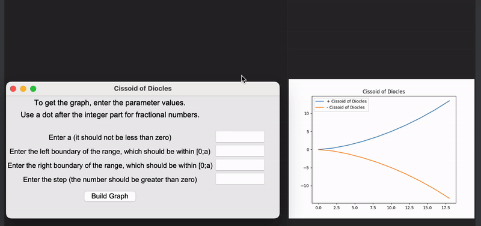

<h1 align="center">Cissoid of Diocles Graph Plotter</h1>
 

 
 
    

<h2>Project description</h2>
This project is a <b>Python</b> application that allows users to plot the Cissoid of Diocles graph using a <b>Tkinter</b>-based GUI. The application takes user input for the necessary parameters and plots the graph using <b>Matplotlib</b>.

<h2>Features</h2>
<ul>
  <li><b>Graph Plotting:</b> Plots the Cissoid of Diocles graph based on user input.</li>
  <li><b>Error Handling:</b> Provides feedback if the input values are invalid.</li>
  <li><b>Graph Customization:</b> Allows users to set the range and step for the graph.</li>
</ul>
 
<h2>Technologies Used</h2>

 Tkinter
 NumPy
 Matplotlib

<h2>Getting Started</h2>
To get a local copy up and running, follow these simple steps.

<h3>Prerequisites</h3>
Before you begin, ensure you have python installed.

<h3>Installation</h3>
<h5>Clone the repository:</h5>
git clone https://github.com/Yuliia-Kruta/cissoid-of-diocles.git

<h5>Navigate to the project directory:</h5>
cd cissoid-of-diocles

<h5>Install the dependencies:</h5>
pip install numpy matplotlib

<h5>Run the application:</h5>
python main.py

<h2>How to Use</h2>
Enter the parameters: 
- <b>a:</b> A number greater than or equal to 0. 
- <b>Left Boundary (x1):</b> A number within the range [0, a). 
- <b>Right Boundary (x2):</b> A number within the range [0, a) and greater than x1. 
- <b>Step:</b> A number greater than 0. 
Click on "Build Graph" to generate and display the Cissoid of Diocles graph.

<h2>License</h2>
Distributed under the MIT License. See LICENSE for more information.
